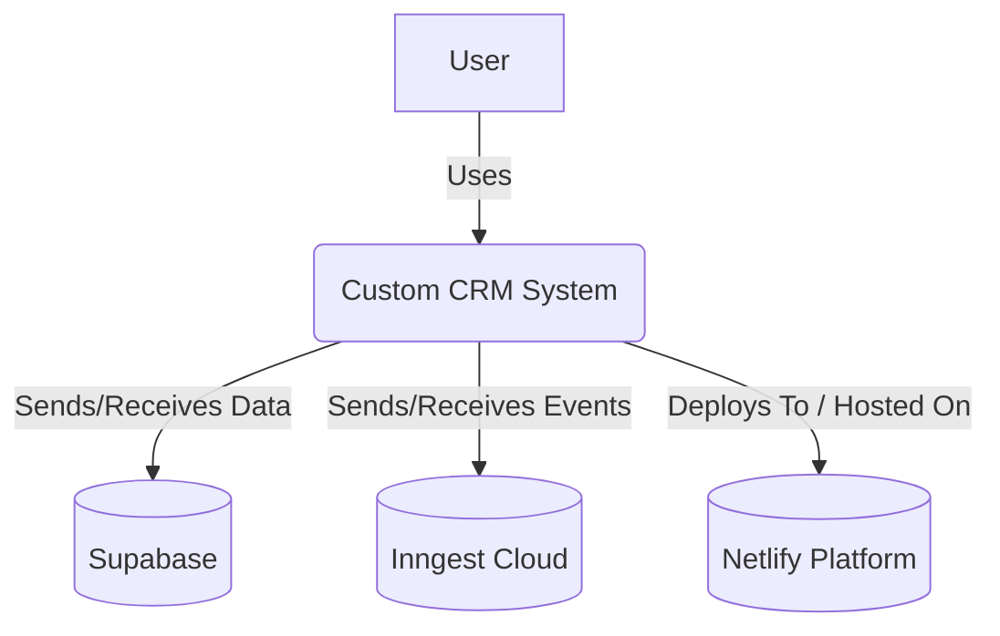
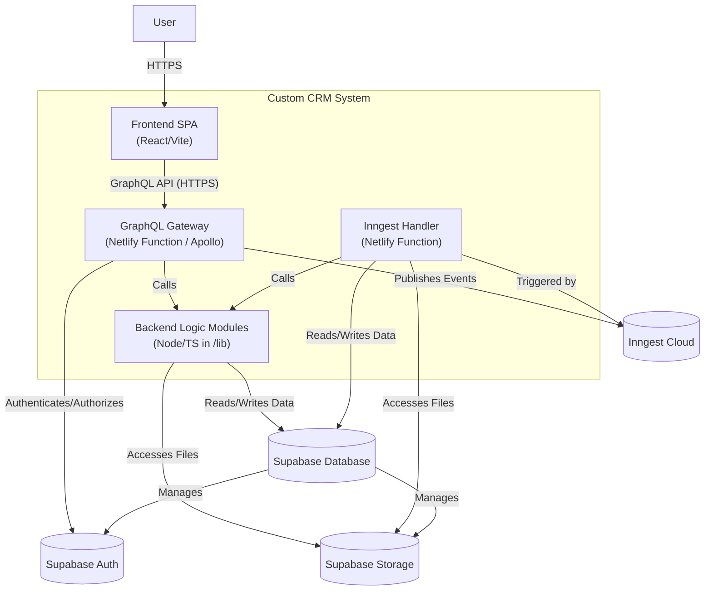
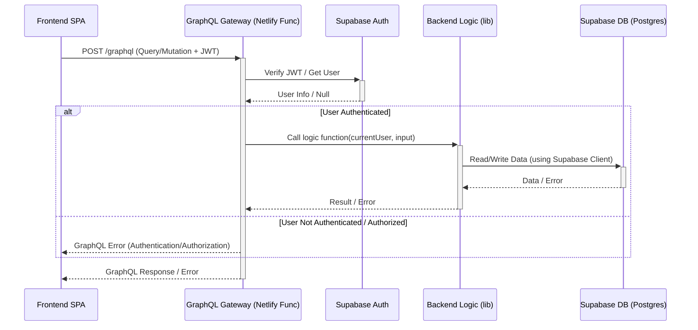
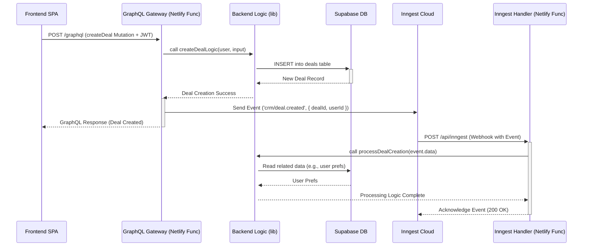

# Architecture Decision Record (ADR): Custom CRM System

**Status:** Proposed | **Date:** 2025-05-01

## 1. Context

This document outlines the architectural decisions for building a custom Customer Relationship Management (CRM) system intended to replace Pipedrive. The system aims to be scalable, maintainable, secure, and ready for future expansion into adjacent business domains (e.g., Accounting, Logistics), aligning with Domain-Driven Design (DDD) principles. This ADR reflects lessons learned from previous projects and incorporates feedback on simplifying the developer experience and mitigating common risks.

## 2. Goal

Build a custom CRM system leveraging a serverless microservices architecture deployed on Netlify, with robust security, compliance, and scalability features, designed for future extensibility.

## 3. Core Principles

1.  **Microservices Architecture:** Decompose functionality into independent backend services (Netlify Functions or logic modules) aligned with DDD principles, enabling easier addition of new business domains.
2.  **GraphQL API Layer:** Utilize a central GraphQL Gateway (as a Netlify Function) to provide a unified, typed API for the frontend, simplifying data aggregation across domains. **Decision:** Use a custom gateway, **not** Supabase `pg_graphql` directly for the main API (See ADR-001).
3.  **Serverless First:** Leverage Netlify Functions (gateway, backend logic) and Supabase (database, auth) to minimize infrastructure management.
4.  **Local First Development:** Prioritize efficient local development and testing using `netlify dev` and `supabase start`. Local credentials obtained via `supabase status`.
5.  **Clear Separation of Concerns:** Maintain boundaries between Frontend (UI - React/Vite), GraphQL Gateway (API - Apollo Server), Backend Logic (Domain Logic - Node/TS modules), Database (Data Persistence - Supabase/Postgres), and Authentication (Supabase Auth).
6.  **Infrastructure as Code:** Define configurations in `netlify.toml` and manage schema via Supabase migrations.
7.  **Security by Default:** Implement authentication (Supabase JWT), authorization (Gateway/RLS), Row Level Security, secure function defaults (`SECURITY INVOKER`), input validation, and GraphQL security measures.
8.  **Leverage Managed Services:** Use managed services (Supabase, Netlify, Inngest) where appropriate, but plan for potential exit strategies (See Risks & ADR-003).
9.  **Data Integrity & Privacy:** Ensure data isolation and implement workflows for compliance (GDPR data erasure, etc.).
10. **Automated Testing & Deployment:** Implement comprehensive testing (GraphQL, backend logic, frontend components, E2E) and leverage Netlify CI/CD.
11. **Event-Driven Architecture:** Use asynchronous events (via Inngest - See ADR-003) for crucial cross-service/domain communication, decoupling, and handling background tasks.
12. **Stable Dependencies:** Prioritize latest stable versions (LTS Node, non-RC libraries) and verify compatibility.
13. **Future Extensibility:** Design architectural components (GraphQL schema, Backend Logic Modules, Events) to facilitate adding new features and business domains (See ADR-004).

## 4. Architecture Outline

*   **Frontend:** React SPA (built with Vite - See ADR-002), communicates via GraphQL. Hosted on Netlify CDN.
*   **API Layer:** GraphQL Gateway (Apollo Server on Netlify Function) at `/graphql`. Authenticates requests (Supabase JWT), performs authorization checks, validates inputs, and orchestrates data fetching/mutations by calling backend logic modules or Supabase directly for simple cases.
*   **Backend Logic:** Domain-specific Node.js/TypeScript modules (likely in `/lib` or `/packages` monorepo structure) containing business logic, complex validation, and database interactions. Invoked by GraphQL resolvers.
*   **Database:** Supabase (PostgreSQL) with RLS enabled. Accessed primarily by backend logic modules via Supabase client library.
*   **Authentication:** Supabase Auth. JWT passed from Frontend to Gateway via `Authorization` header.
*   **Asynchronous Workflows:** Inngest for event-driven, cross-service communication and background task processing (e.g., post-mutation workflows, data cleanup, future A2A communication bus - See ADR-003). Requires an Inngest handler Netlify Function.
*   **File Storage:** Supabase Storage for user uploads, etc. Accessed via Supabase client library.
*   **Deployment:** Netlify handles frontend hosting, GraphQL Gateway function, Inngest handler function, and any other potential backend Netlify Functions. CI/CD via Netlify Build/GitHub Actions.

**Diagrams:**

**C4 Model - Level 1: System Context**

**C4 Model - Level 2: Container Diagram**

**Sequence Diagram: Authenticated GraphQL Request**

**Sequence Diagram: Async Event Workflow (e.g., Deal Creation)**

**Future Expansion:** New domains (Accounting, etc.) added as backend logic modules/services, integrated into the GraphQL schema via the Gateway. Inngest handles async communication between domains.

## 5. Key Technology Choices & Rationale

*   **Hosting & Serverless (Functions/Gateway): Netlify**
    *   **Rationale:** Integrated platform, simplifies deployment of frontend, gateway, and backend functions. Aligns with DDD/microservices. Reduces infrastructure overhead. Good developer experience with Netlify Dev.
*   **API Layer: GraphQL (Apollo Server on Netlify Function)**
    *   **Rationale:** Flexible, typed API for frontend, simplifies cross-domain data aggregation. Reduces over/under-fetching. Well-positioned for future AI agent integration (e.g., providing context via MCP concepts). Provides a necessary abstraction layer over the database for security and business logic. (See ADR-001)
    *   **Alternatives Considered:**
        *   Supabase `pg_graphql`: **Rejected** for main API to provide clear separation/control layer, allow for custom business logic, enforce fine-grained authorization beyond RLS, and facilitate stitching future non-Supabase data sources. Using both `pg_graphql` and a custom gateway introduces unnecessary complexity and potential confusion.
        *   Lighter GraphQL Servers (Yoga, Mercurius): Potential fallback if Apollo Server cold starts prove consistently problematic (>500ms p95). (See Risks).
        *   REST API: Rejected due to potential for over/under-fetching and increased complexity in managing multiple endpoints compared to a unified GraphQL schema, especially with future domain expansion.
    *   **Cost Considerations:** Be mindful of potential Apollo Studio costs if relying heavily on paid features. Core Apollo Server is open source.
*   **Identity & Access Management (IAM): Supabase Auth**
    *   **Rationale:** Managed, integrated with DB/RLS, good DX. JWT used for authenticating GraphQL requests. Supports various auth providers.
*   **Database: Supabase (PostgreSQL)**
    *   **Rationale:** Managed Postgres with RLS, backups, extensions. Excellent developer experience and integration with Auth/Storage.
*   **Asynchronous Communication: Inngest** (See ADR-003)
    *   **Rationale:** Reliable event handling, scheduling, retries, good developer experience for decoupling domains and handling async tasks. Simplifies implementation of workflows like GDPR deletion or post-processing tasks. Well-suited as a potential future A2A communication bus.
    *   **Risk Mitigation:** Define criteria for evaluating alternatives (e.g., managed queues like SQS, `pg_cron` + custom worker, Supabase Edge Functions with limitations) if cost, features, or vendor lock-in become significant concerns. Schedule regular review. (See Risks/Roadmap).
*   **Frontend Framework: React + TypeScript + Vite** (See ADR-002)
    *   **Rationale:** Strong ecosystem, TS typing. Vite provides superior DX, build performance, and maintenance status compared to Create React App (CRA).
*   **UI Component Library: Chakra UI**
    *   **Rationale:** Accelerates development, accessible components, good composability.
    *   **Future Consideration:** Re-evaluate if/when React Server Components (RSC) become a core requirement, potentially choosing an RSC-compatible library if needed, though current architecture focuses on a client-rendered SPA.
*   **Dependency Versioning Strategy:** Use Node LTS (e.g., 18 or 20). Use latest stable libraries, checking compatibility (e.g., React vs. UI Kit vs. Apollo Client). Avoid Release Candidates (RCs) for critical dependencies like React in production.

## 6. Key Architectural Risks & Considerations

*   **GraphQL Gateway Cold Starts:** Serverless functions have cold starts. **Mitigation:** Monitor p95 latency for the gateway function via Netlify logs/analytics or external monitoring. If >500ms consistently impacts UX:
    *   Investigate Netlify Function settings (e.g., memory).
    *   Consider Netlify Function provisioned concurrency (if available/cost-effective).
    *   Explore lighter GraphQL servers (Yoga).
    *   *Less Ideal:* Edge Functions (have limitations on Node APIs, execution time).
*   **Serverless Limits:** Be mindful of Netlify Function execution time limits (e.g., 10s default, configurable up to 26s for background) and memory limits. **Mitigation:** Design resolvers efficiently. Offload long-running tasks to Inngest. Increase function timeout if necessary and justified.
*   **GraphQL Security:** Potential for DoS via complex/malicious queries. **Mitigation:**
    *   Implement query depth limiting (mandatory).
    *   Implement query complexity analysis (mandatory).
    *   Disable introspection in production (mandatory).
    *   Consider Automatic Persisted Queries (APQ) or Operation Whitelisting for production (recommended).
    *   Implement input validation rigorously in resolvers/logic modules.
    *   (See `DEVELOPER_RUNBOOK.md` for implementation details).
*   **Inngest Lock-in/Cost:** Dependency on a third-party SaaS for core async processing. **Mitigation:**
    *   Monitor usage against pricing tiers.
    *   Define an exit strategy: Identify specific Inngest features used (events, scheduling, retries) and evaluate alternatives (e.g., `pg_cron` + Supabase Function/worker, AWS SQS + Lambda) based on complexity and cost. Abstract Inngest calls behind internal service interfaces where feasible. Schedule periodic re-evaluation (See Roadmap). (See ADR-003).
*   **Compliance & Data Handling (GDPR/CCPA):** Requires specific workflows for data access, portability, and especially erasure (Right to be Forgotten). **Mitigation:**
    *   Design and implement an explicit data erasure workflow (e.g., using Inngest triggered by `auth.users` deletion hook or admin action) that removes user data from all relevant tables *and* associated Supabase Storage objects. Document this flow.
    *   Ensure RLS and authorization logic correctly handle data access requests.
    *   Clarify data residency requirements. If strict residency (e.g., EU-only) is needed, select the appropriate Supabase project region and verify Netlify's function execution/data processing locations align with requirements.
*   **Monorepo Build Times:** If using a monorepo (`packages/`), CI build times may increase as the project grows. **Mitigation:** Not an immediate concern. Consider build caching tools like Nx or Turborepo *later* if build times become problematic (>10-15 mins).
*   **Testing Complexity:** Ensuring adequate test coverage across frontend, gateway, backend logic, and database requires effort. **Mitigation:** Implement a layered testing strategy (unit, integration, E2E) as outlined in the Run-book. Automate tests in CI.

--- 